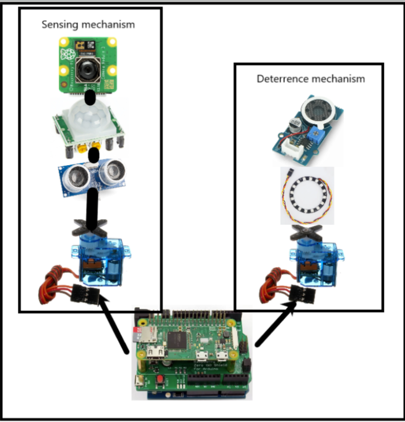
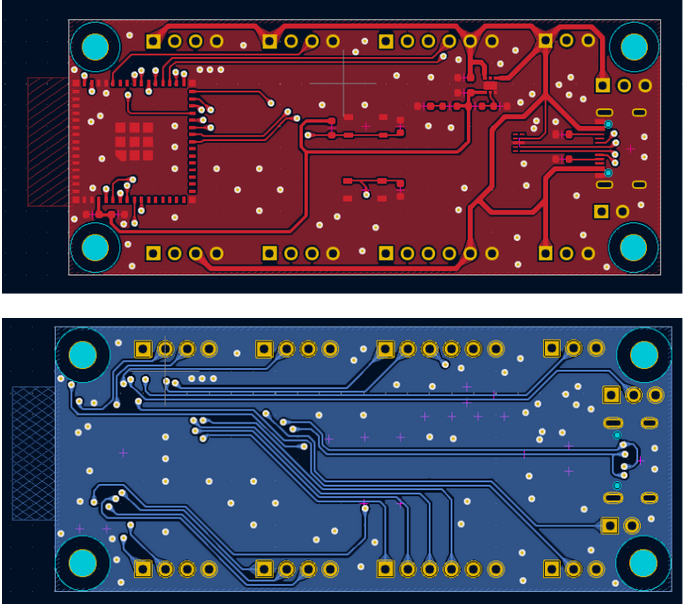

# Feb 15, 2023

**Text:** We had been having a lot of issues with our lawn back in vancouver due to rodents coming in and digging it up for grubs. My parents had tried many available solutions on the market to no avail. So I wanted to make something that could help solve this problem.

---

# Feb 21, 2023

**Text:** Thinking about it made me realize that not only do I want to deter rodents but also detect them and have some sort of localized action to have a more efficient detterance. I talked about the pipeline a lot with the ta and alongside the design document I now have a better idea for how to go about this.

---

# March 2, 2023

**Text:** Its time to start making PCBs. I have chosen an esp32 since it is cheap and has wifi and bluetooth so it might be perfect to coommunicate with the camera etc. The pcb making process took me very long. Since I am incharge of electronics in my group I spend the whole night on kicad making this pcb.

---

# March 18, 2023

**Text:** with winter break I wanted to test the object detection models that already exist and how good they are. So I chose detectron2 and YOLOv8 as my go tos since they haev a lot of documentation. Detectron is a bit slow for real time evaluation so We are going to go with YOLO.

---

# April 8, 2023

**Text:** We realized a bit late that esp32 might not be up for task to handle such a heavy model but raspberry pi could definetely do it! so I went ahead and bought a raspberry pi today so rishab and I could get it set up and start transferring our codebase over.

---

# April 18, 2023

**Text:** We have been doing a lot of testing almost everyday checking all the sensors and motors and how each component is moving. We finished the project in a week working tens of hours on some days. It was a challenge but fun debugging, lets see how it performs in real life. Well test it next week.

---

# April 22, 2023

**Text:** We tested the project outside today! i bought some peanuts and sunflower kennel for the squirrels as a bait and they came for it! but as soon as the detterance system started working, oh my, they all ran away! lawn protected!

---
